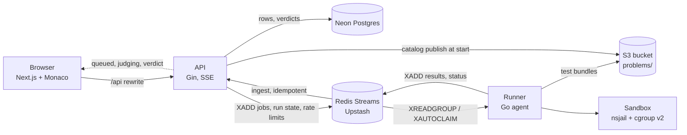

<p align="center">
  
</p>

<h1 align="center">LeetForce</h1>

<p align="center">
  A distributed, sandboxed code execution platform. Submit Python, C++, Java, or Go and get a verdict with runtime and memory.
</p>

## What it is

LeetForce is a LeetCode-style judge: you write a solution in Python, C++, Java or Go in a browser editor, and a fleet of runners compiles and runs it in isolated sandboxes against hidden tests. The result is one verdict (AC, WA, TLE, MLE, RE, CE, OLE) with runtime and memory. Untrusted code only ever runs inside the sandbox (nsjail plus cgroup v2, with gVisor as an opt-in backend), runners never touch the database, and hidden tests, expected outputs and raw stderr are never returned for Submit.

Status: Phases 0 to 13 are merged (see [docs/PROGRESS.md](docs/PROGRESS.md)). The cloud deployment is code only: the S3 bucket is the one cloud resource created for it so far, and the runner AMI, the k3s control host and the runner fleet have not been applied or built ([docs/phases/phase-13.md](docs/phases/phase-13.md)). Contests, the leaderboard and launch readiness are Phases 14 to 16.

## Architecture



The same flow as text, with the code that implements each step:

```
browser --POST /api/submissions--> API (api/internal/server)   validate, INSERT submissions (stamps test_set_version)
API --XADD <prefix>:jobs--> Redis Streams                      queue/queue.go (consumer group "runners")
runner --XREADGROUP / XAUTOCLAIM--> job                        runner/internal/agent (heartbeat every 10 s)
runner --GetBundle--> S3 problems/<slug>/<version>.tar.gz      runner/internal/problems, storage/
runner --engine.Judge--> sandbox.Run (nsjail + cgroup v2)      judge/engine, judge/sandbox
runner --Publish--> <prefix>:results (+ <prefix>:status)       queue.Publish (idempotent per submission and version)
API ingest --XREADGROUP "api"--> store.RecordVerdict           api/internal/ingest, api/internal/store (idempotent)
browser <--SSE /api/submissions/:id/events-- API               queued -> judging -> verdict
```

Run (samples or custom input) uses the same queue but keeps its state in a short-lived Redis key and never reaches Postgres. The phase-by-phase "as built" detail is in [docs/FLOW.md](docs/FLOW.md).

| Directory | Contents |
|---|---|
| `judge/` | Judge engine, language drivers, checkers, sandbox, adversarial suite, `judge` CLI |
| `queue/` | Redis Streams queue, results, status, run state, rate limiter, `lfq` tool |
| `runner/` | Runner agent (pulls jobs, judges, reports; no database access) |
| `api/` | Gin API, SSE, ingest, reaper, rejudge, goose migrations |
| `storage/` | S3 client (host IAM role when no keys are set) |
| `web/` | Next.js frontend with Monaco |
| `problems/` | Problem definitions (`problem.yaml`, tests, statements, starters, reference solutions) |
| `infra/` | Terraform: `bootstrap` (S3), `neon` (database project), `aws` (hosts) |
| `packer/`, `ansible/`, `k8s/`, `observability/` | Runner AMI, host provisioning, API manifests, Prometheus/Grafana/Loki |

## Quickstart (local)

The sandbox needs a real Linux host with cgroup v2, nsjail and passwordless sudo; the project develops on an Ubuntu 24.04 x86 EC2 host ([ADR 0003](docs/adr/0003-dev-environment-ec2-x86.md), `scripts/setup-dev-host.sh`). The web app and API can run anywhere Go and Node run.

1. Configure. Copy `.env.example` to `.env` (git-ignored) and fill it in:
   - `LEETFORCE_REDIS_URL`: an Upstash `rediss://` URL, or `redis://127.0.0.1:6379/0` for the local Redis from step 2.
   - `DATABASE_URL`: Neon Postgres URL (quote it; it contains `&`). `LEETFORCE_MIGRATE_DATABASE_URL` is the optional direct endpoint for migrations.
   - `LEETFORCE_S3_ENDPOINT`, `LEETFORCE_S3_BUCKET`, `LEETFORCE_S3_ACCESS_KEY`, `LEETFORCE_S3_SECRET_KEY`, `LEETFORCE_S3_USE_TLS`: real S3 (ADR 0021). Leave `LEETFORCE_S3_ENDPOINT` empty to read problems straight from `problems/`.
   - `LEETFORCE_API_URL` (web to API, default `http://127.0.0.1:8080`), `LEETFORCE_TRUSTED_PROXIES` (use `127.0.0.1` behind the Next.js proxy), optional `LEETFORCE_LIMIT_*`, and `LEETFORCE_GRAFANA_PASSWORD` for the observability stack.
2. Local Redis: `make dev` (Docker Compose; Redis only, S3 is real AWS S3 since Phase 13). `make down` stops it.
3. Database: `make migrate-up` (goose, `api/migrations`, URL from `.env`).
4. Build and start, each in its own terminal, with `.env` loaded into the environment:
   ```bash
   make build-api build-runner
   bin/api                            # listens on :8080 (LEETFORCE_API_ADDR), metrics on 127.0.0.1:9102
   sudo -E bin/runner                 # root, or the unprivileged systemd unit in scripts/runner (ADR 0014); metrics on 127.0.0.1:9101
   cd web && npm ci && npm run dev    # http://localhost:3000
   ```
5. Open http://localhost:3000/problems, sign up, pick a problem, and use Run (Ctrl+Enter) or Submit (Ctrl+Shift+Enter).

Judge a solution without the queue, API or web (local judge CLI, needs root and nsjail):

```bash
make build-judge
sudo -n bin/judge run problems/sample-sum problems/sample-sum/solutions/python/ac.py   # exit 0 = AC
sudo -n bin/judge run -all -detail -lang cpp problems/sample-sum <solution-file>
make validate-problems                                                                  # structure + reference solutions for every problem
```

## Commands

Go targets run per module in `GO_MODULES` (`judge queue runner api storage`) on a Linux host. Targets marked BILLABLE or "real DB" touch real services; read the Makefile comment first.

| Command | What it does |
|---|---|
| `make dev` / `make down` | Start / stop the local Redis (Compose) |
| `make fmt` / `make lint` / `make test` | Format, vet + golangci-lint, `go test` per Go module (sandbox-backed tests skip without root) |
| `make test-sandbox` | Functional sandbox and judge-engine tests in nsjail (`sudo -n`) |
| `make test-adversarial [RUN=TestName]` | Sandbox containment suite, run as root in a memory-capped systemd scope |
| `make test-matrix` | Phase 2 exit test: one solution per verdict in each language (28 runs) |
| `make bench-sandbox` | nsjail vs gVisor benchmark (needs `runsc`, `scripts/setup-gvisor.sh`) |
| `make build-judge` / `make build-runner` / `make build-api` | Build `bin/judge`, `bin/runner` + `bin/lfq`, `bin/api` |
| `make validate-problems [DIR=problems/<slug>]` | `judge validate` for every problem (sandbox, `sudo -n`) |
| `make migrate-up` / `migrate-down` / `migrate-status` | goose migrations on Neon |
| `make test-crash` | Kill a runner mid-job; another reclaims it; one verdict (needs `LEETFORCE_REDIS_URL`) |
| `make test-api-e2e`, `test-live-e2e`, `test-auth-e2e`, `test-rejudge-e2e` | End-to-end gates for Phases 4, 5, 9, 10 (real DB and Redis; they delete the rows they create) |
| `make test-obs-e2e` | Phase 11: metrics follow a live flow (dev host) |
| `make dev-obs` / `make down-obs` / `make test-alerts` | Prometheus, Grafana, Loki, Alloy stack; promtool alert tests (Docker) |
| `make tf-validate` | `fmt` and `validate` for the three Terraform stacks (no credentials) |
| `make test-destroy-isolation` | Offline check that destroying `infra/aws` cannot reach `infra/neon` |
| `make packer-validate` / `make lint-ansible` | Validate the AMI template / lint the playbook (Docker, free) |
| `make build-ami` | BILLABLE: build the runner AMI (a `t3.small` builder for about 15 minutes, then a snapshot) |
| `make test-runner-loss` | BILLABLE and destructive: terminate a runner EC2 host under load (needs `LEETFORCE_CONFIRM_TERMINATE=yes`); not run yet |
| `scripts/arena.sh up\|down\|status` | BILLABLE: create or destroy `infra/aws` (typed confirmation); never touches `infra/neon` |
| `scripts/k3s/push-ssm.sh [--apply]` | Stage SSM parameters (dry run unless `--apply`) |
| `scripts/scan-staged.sh [full]` | Trivy on the staged tree via the dev host |
| `cd api && go run ./cmd/rejudge [-dry-run] <slug>` | Sync one problem and rejudge its stale submissions |
| `cd web && npm run lint`, `npm run typecheck`, `npm run build` | Frontend checks |

## Cost table

Recurring costs that are billed while the resource exists or runs. Dollar figures are **UNVERIFIED list-price assumptions** for `ap-south-1` (Mumbai), written from memory of AWS public pricing and not read from the account's bill or the AWS pricing pages: `t3.micro` about $0.0104 per hour, `t3.small` about $0.0208 per hour, gp3 about $0.0912 per GB-month, public IPv4 $0.005 per hour, S3 Standard about $0.025 per GB-month, 730 hours per month. Check the AWS pricing pages and Cost Explorer before relying on them. A month-by-month estimate is in [docs/cost-review.md](docs/cost-review.md).

| Resource | Introduced | Billing | Approx. cost, UNVERIFIED | State today |
|---|---|---|---|---|
| EC2 `t3.micro` dev host (`leetforce-dev`) | Phase 1 | Per hour while running | about $7.6 a month if left running | Existed and running at the last recorded check (phase-13 log); stop it when idle. t3 unlimited CPU credits can add surplus charges under sustained CPU. See [ADR 0003](docs/adr/0003-dev-environment-ec2-x86.md). |
| EBS gp3 volume, 15 GiB (dev host) | Phase 1 | Per GB-month, also while stopped | about $1.4 a month | Exists; deleted only when the instance is terminated. |
| Public IPv4 address (dev host) | Phase 1 | Per hour while attached | about $3.7 a month | Attached while running; changes on stop/start unless an Elastic IP is attached (an unattached Elastic IP is also billed). |
| EC2 `t3.small` control host (`leetforce-control`) | Phase 12 | Per hour while it exists and runs | about $15.2 a month | Code only. Created by `scripts/arena.sh up` (typed confirmation); `control_instance_type` in `infra/aws`. |
| EC2 `t3.small` runner hosts, Auto Scaling group (`runner_count`, default 1) | Phase 12, ASG in Phase 13 | Per hour each; the group itself is free | about $15.2 a month each | Code only. The group keeps `runner_count` instances (min = max = desired) until `arena.sh down`; a replacement host costs the same as the one it replaces. |
| EBS gp3 volume, 15 GiB, encrypted, per new host | Phase 12 | Per GB-month each | about $1.4 a month each | Code only. Deleted with the instance (`delete_on_termination`). |
| Public IPv4 address per new host | Phase 12 | Per hour each while attached | about $3.7 a month each | Code only. Needed because there is no NAT gateway; the control host and every runner has one. |
| Runner AMI snapshot (Packer) | Phase 12 | Per GB-month of snapshot while the AMI is registered | up to about $0.75 a month for a full 15 GiB at an assumed $0.05 per GB-month | No AMI exists (three build attempts failed: build tooling, a scan timeout, base-image findings; a fourth was not run). A build also bills a `t3.small` builder for about 15 to 18 minutes (a few cents; the failed attempts billed about the same). Deregister old AMIs and delete their snapshots. |
| Neon Postgres project (`ap-southeast-1`) | Phase 4, adopted by Terraform in Phase 12 | Depends on the Neon plan | UNVERIFIED: plan and limits never checked. `infra/neon` assumes the free plan (6 h restore window, the free maximum) | Exists. Compute wakes on use; the reaper sweeps every 15 minutes and each sweep wakes it. |
| Upstash Redis | Phase 3 | Depends on the Upstash plan (monthly command budget) | UNVERIFIED: plan and limit never checked. The queue-depth sampler alone is about 216k commands a month at the 60 s default (ADR 0019) | Exists. 10 s sampling would be about 1.3M a month. |
| S3 bucket `leetforce-<account id>-data` (versioned, SSE-S3) | Phase 13 | Per GB-month plus requests | well under $1 a month: a few MB at about $0.025 per GB-month, plus requests | Exists (applied in Phase 13, owner approved). Holds `problems/` bundles (kept for rejudges) and `tfstate/` (old versions expire after 90 days, ADR 0021). |
| Container images in GHCR (private) | Phase 13 | Free within GitHub's package allowance | UNVERIFIED allowance | Nothing pushed yet. The API image holds the hidden tests, so it must stay private. |

Not billable: SSM Parameter Store standard parameters, SSM Run Command, GitHub Actions OIDC, IAM roles and security groups, and the Terraform state lock (the S3 lock file, no DynamoDB table). No VPC endpoints, NAT gateway or Elastic IPs are used. Data transfer out of AWS is billed per GB after the free allowance and is not estimated here (UNVERIFIED; expected near zero at current traffic). As of the last recorded state, the S3 bucket and the dev host exist; nothing in `infra/aws` has been applied and no AMI has been built, so the control and runner rows apply from the first `arena.sh up` or successful `make build-ami`.
