<p align="center">
  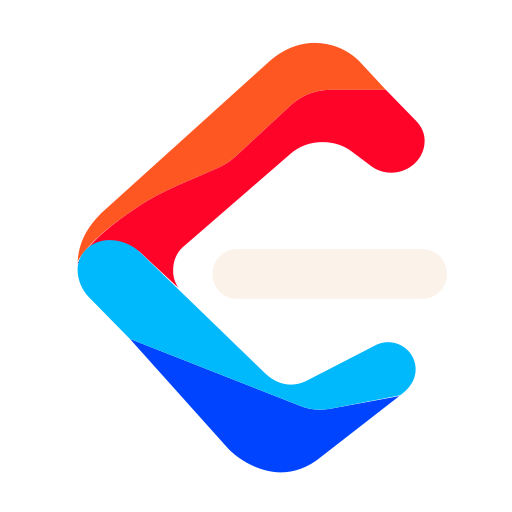
</p>

<h1 align="center">LeetForce</h1>

<p align="center">
  A distributed, sandboxed code execution platform. Submit Python, C++, Java, or Go and get a verdict with runtime and memory.
</p>

<p align="center">
  
  
  
  
  
  
  
  
  
  
  
  
</p>

<p align="center">
  <a href="#what-it-is">Overview</a> &middot;
  <a href="#screenshots">Screenshots</a> &middot;
  <a href="#architecture">Architecture</a> &middot;
  <a href="#system-design-high-level">System design</a> &middot;
  <a href="#observability">Observability</a> &middot;
  <a href="#aws-identity-and-access-iam">IAM</a> &middot;
  <a href="#quickstart-local">Quickstart</a> &middot;
  <a href="#commands">Commands</a> &middot;
  <a href="#cost-table">Costs</a> &middot;
  <a href="#documentation">Docs</a>
</p>

<p align="center">
  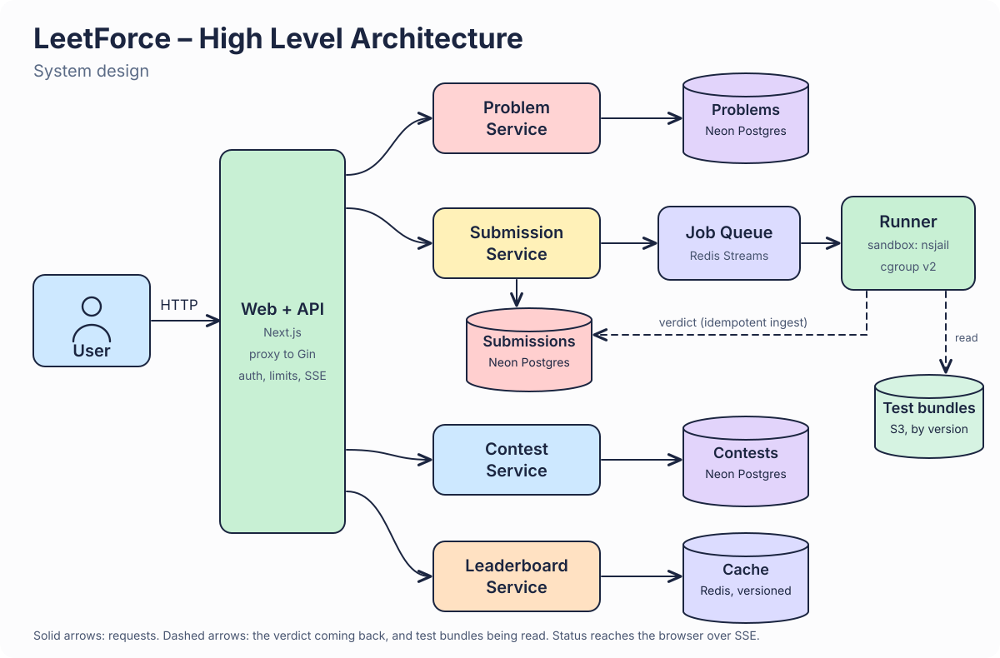
</p>

<p align="center"><sub>The service boxes are modules inside one Go API process, not separate deployments. The database is Neon Postgres, not Amazon RDS. Source of the picture: <a href="docs/images/hld.svg">docs/images/hld.svg</a>.</sub></p>

## Screenshots

<p align="center">
  <a href="docs/images/website/03-workspace-dark.jpg">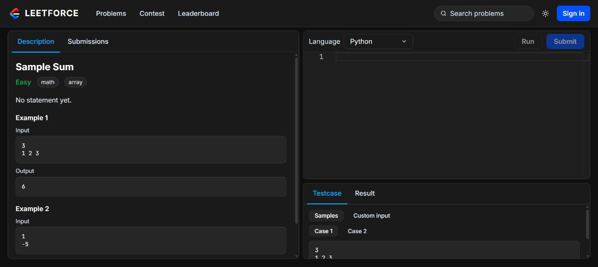</a><br>
  <sub><b>Problem workspace</b>: description, Monaco editor, Run and Submit, console with Testcase and Result tabs.</sub>
</p>

<table width="100%">
  <tr>
    <td width="50%"><a href="docs/images/website/01-home-dark.jpg">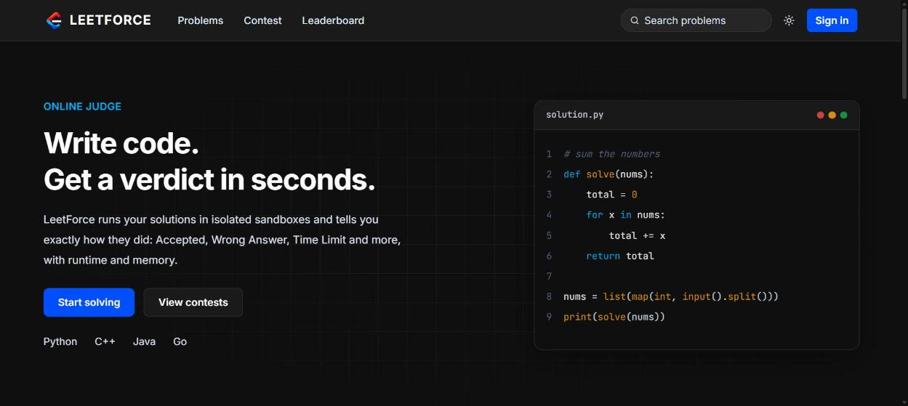</a><br><sub><b>Home</b></sub></td>
    <td width="50%"><a href="docs/images/website/02-problems-dark.jpg">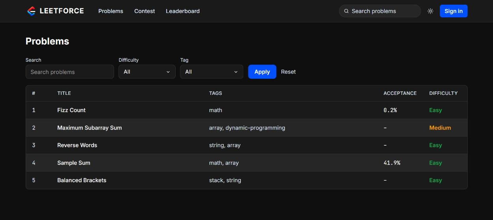</a><br><sub><b>Problem list</b> with search, difficulty and tag filters.</sub></td>
  </tr>
  <tr>
    <td width="50%"><a href="docs/images/website/05-contests-dark.jpg">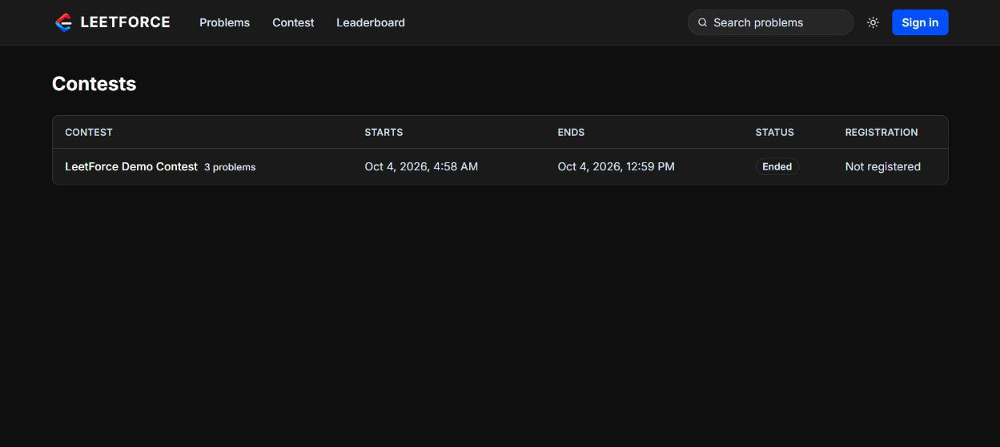</a><br><sub><b>Contests</b></sub></td>
    <td width="50%"><a href="docs/images/website/04-leaderboard-dark.jpg">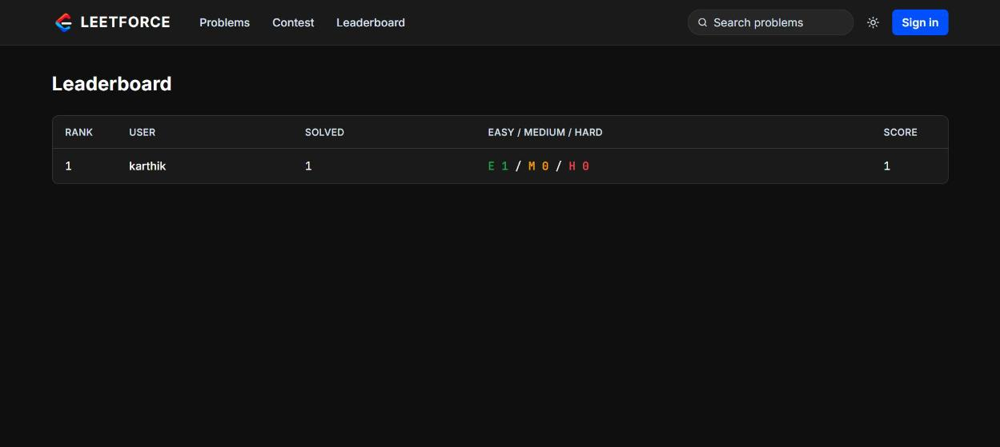</a><br><sub><b>Leaderboard</b>, ranked by solved problems and score.</sub></td>
  </tr>
</table>

<sub>Taken from a temporary public demo (signed out; the signed-in result panel is not shown). No live site is kept running because the host is billed while it runs. All pictures: [docs/images/website/](docs/images/website/), observability pictures under [Observability](#observability).</sub>

## What it is

LeetForce is a LeetCode-style judge: you write a solution in Python, C++, Java or Go in a browser editor, and a fleet of runners compiles and runs it in isolated sandboxes against hidden tests. The result is one verdict (AC, WA, TLE, MLE, RE, CE, OLE) with runtime and memory. Untrusted code only ever runs inside the sandbox (nsjail plus cgroup v2, with gVisor as an opt-in backend), runners never touch the database, and hidden tests, expected outputs and raw stderr are never returned for Submit.

Status: Phases 0 to 16 are built (see [docs/PROGRESS.md](docs/PROGRESS.md)), including contests, the leaderboard and launch readiness (security review, load test, backup and restore runbook). The cloud deployment is code only: the S3 bucket is the one cloud resource created for it so far, and the runner AMI, the k3s control host and the runner fleet have not been applied or built ([docs/phases/phase-13.md](docs/phases/phase-13.md), [docs/launch-checklist.md](docs/launch-checklist.md)).

## Highlights

| | |
|---|---|
| **Safe by design** | Untrusted code runs only in a sandbox (nsjail and cgroup v2). The whole cgroup is killed on a timeout or limit breach. Hidden tests, expected outputs and raw stderr never leave the server on Submit. |
| **Live verdicts** | Queued, judging and the final verdict stream to the browser over SSE. |
| **Crash tolerant** | Redis Streams consumer groups with `XAUTOCLAIM` re-deliver a lost runner's job, and verdict writes are idempotent. |
| **Rejudge on demand** | Every submission records its test-set version, so a fixed test set re-queues old submissions. |
| **Contests and rankings** | Timed contests with contest-only problems, ICPC-style scoring and a cached global leaderboard. |
| **Four languages** | Python, C++, Java and Go, each with its own driver and starter code. |
| **Observable** | Prometheus, Grafana and Loki with alert rules, and Tempo traces that follow one submission from the API through the queue to the runner. |
| **Tested under load** | 616 submissions from 6 simulated users in 3 minutes on one `t3.micro` host: every one reached a verdict, no errors, 0.5 s median and 1.1 s p95 from submit to verdict. The load tool submits a trivial program, so this measures the queue, runner and sandbox path, not heavy problems ([log](docs/phases/phase-16-log.md)). |
| **Launch checked** | A security review, a load tester and a restore drill, all written up in `docs/`. |

## Tech stack

<table width="100%">
  <thead>
    <tr><th width="22%" align="left">Area</th><th align="left">Technologies<br></th></tr>
  </thead>
  <tbody>
    <tr><td><b>Judge, runner, API</b></td><td> </td></tr>
    <tr><td><b>Web</b></td><td>    </td></tr>
    <tr><td><b>Data</b></td><td>  </td></tr>
    <tr><td><b>Sandbox</b></td><td>nsjail, cgroup v2, gVisor (opt-in)</td></tr>
    <tr><td><b>Infrastructure</b></td><td>     </td></tr>
    <tr><td><b>Observability</b></td><td>     </td></tr>
    <tr><td><b>Identity and secrets</b></td><td>  </td></tr>
    <tr><td><b>CI and security</b></td><td> </td></tr>
  </tbody>
</table>

## Architecture

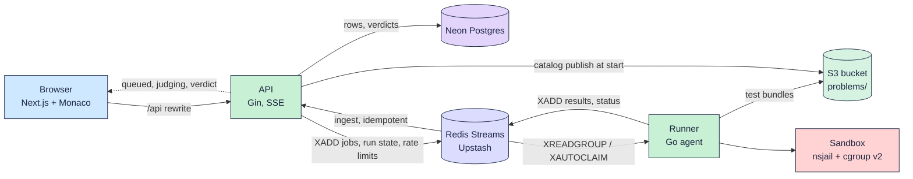

The same flow as text, with the code that implements each step:

```
browser --POST /api/submissions--> API (api/internal/server)   validate, INSERT submissions (stamps test_set_version)
API --XADD <prefix>:jobs--> Redis Streams                      queue/queue.go (consumer group "runners")
runner --XREADGROUP / XAUTOCLAIM--> job                        runner/internal/agent (heartbeat every 10 s)
runner --GetBundle--> S3 problems/<slug>/<version>.tar.gz      runner/internal/problems, storage/
runner --engine.Judge--> sandbox.Run (nsjail + cgroup v2)      judge/engine, judge/sandbox
runner --Publish--> <prefix>:results (+ <prefix>:status)       queue.Publish (idempotent per submission and version)
API ingest --XREADGROUP "api"--> store.RecordVerdict           api/internal/ingest, api/internal/store (idempotent)
browser <--SSE /api/submissions/:id/events-- API               queued -> judging -> verdict
```

Run (samples or custom input) uses the same queue but keeps its state in a short-lived Redis key and never reaches Postgres. The phase-by-phase "as built" detail is in [docs/FLOW.md](docs/FLOW.md).

| Directory | Contents |
|---|---|
| `judge/` | Judge engine, language drivers, checkers, sandbox, adversarial suite, `judge` CLI |
| `queue/` | Redis Streams queue, results, status, run state, rate limiter, `lfq` tool |
| `runner/` | Runner agent (pulls jobs, judges, reports; no database access) |
| `api/` | Gin API, SSE, ingest, reaper, rejudge, goose migrations |
| `storage/` | S3 client (host IAM role when no keys are set) |
| `web/` | Next.js frontend with Monaco |
| `problems/` | Problem definitions (`problem.yaml`, tests, statements, starters, reference solutions) |
| `infra/` | Terraform: `bootstrap` (S3), `neon` (database project), `aws` (hosts) |
| `packer/`, `ansible/`, `k8s/`, `observability/` | Runner AMI, host provisioning, the API Helm chart (`k8s/charts/leetforce-api`), Prometheus/Grafana/Loki/Tempo |
| `telemetry/` | OpenTelemetry setup shared by the API and the runner (traces to Tempo) |

## System design (high-level)

### Goals and constraints

| Goal | How the design meets it |
|---|---|
| Run untrusted code safely | Every run happens in a sandbox (nsjail with a cgroup v2 per job, gVisor as an opt-in backend). The whole cgroup is killed on timeout or limit breach. |
| Never leak hidden tests | Submit returns only the verdict, runtime and memory. Test inputs, expected outputs and raw stderr are shown only for Run on samples or custom input. |
| Survive a crashed runner | Jobs sit in a Redis Streams consumer group. A job that is not acknowledged is reclaimed with `XAUTOCLAIM` by another runner, and verdict writes are idempotent. |
| Rejudge after a test fix | Every submission records the test-set version it was judged against, so stale ones can be re-queued and the new verdict replaces the old one once. |
| Keep the database safe | Runners never connect to Postgres. They only talk to Redis, S3 and the API's ingest path. |
| Stay cheap | One small API host, Neon and Upstash free or low tiers, and runners that can scale from zero. See the [cost table](#cost-table). |

### Components

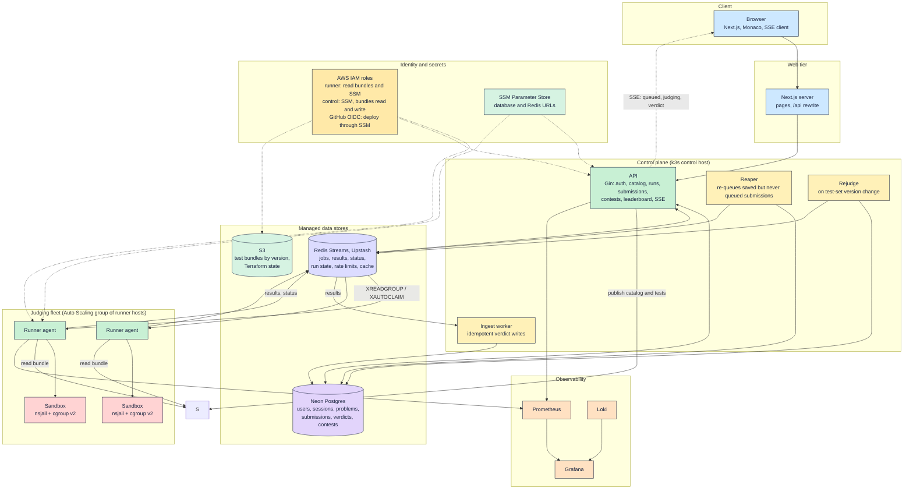

| Component | Responsibility | Where it lives |
|---|---|---|
| Web | Problem list, split-pane workspace, console, contests, leaderboard. Talks only to `/api/*`, which Next.js proxies to the API, so the API address never reaches the browser and there is no CORS. | `web/` |
| API | Accounts and sessions, problem catalog, Run and Submit, contests and visibility rules, rankings, SSE status streams, rate limits, health and metrics. | `api/` |
| Ingest, reaper, rejudge | Background loops inside the API process: write verdicts from the results stream, re-queue submissions that were saved but never queued (an API crash between the insert and the enqueue), and re-queue submissions judged against an older test set. | `api/internal/ingest`, `reaper`, `rejudge` |
| Queue | Redis Streams with consumer groups (`runners` for jobs, `api` for results), per-job heartbeat, run state keys, sliding-window rate limiter, version counters for ranking caches. | `queue/` |
| Runner | Pulls a job, downloads and unpacks the test bundle for the job's version, compiles and runs inside the sandbox, publishes the verdict. No database access. | `runner/` |
| Judge engine and sandbox | Language drivers, checkers, verdict derivation from host facts (exit status, cgroup counters), and the sandbox backends. The harness reports over a dedicated file descriptor, never by parsing user stdout. | `judge/` |
| Storage | S3 bucket with one `problems/<slug>/<version>.tar.gz` bundle per test-set version. Hosts use their IAM role, with no keys on disk. | `storage/`, `infra/` |

### Request flows

**Submit** (the durable path):

1. The browser posts to `/api/submissions`. The API checks the session, the rate limits, the problem and, for a contest submission, the window and registration.
2. The API inserts a `submissions` row stamped with the current `test_set_version`, then adds a job to the Redis jobs stream.
3. A runner claims the job, sends a heartbeat every 10 seconds, fetches the bundle for that version and judges each test in a fresh sandbox.
4. The runner publishes the verdict to the results stream and acknowledges the job.
5. The ingest worker writes the verdict. The write is keyed by submission ID, so a redelivery changes nothing.
6. The API's SSE stream tells the browser about each change: queued, judging, then the verdict. Ranking caches are invalidated after the commit.

**Run** (samples or custom input): the same queue and runners, but the state lives in a short-lived Redis key and never reaches Postgres. This is the only path that may show failing case details.

**Contest**: a contest is a timed window over a fixed problem set. Its status (upcoming, running, ended) is derived from the clock, never stored. Contest problems are hidden from the public catalog until the start, and during the contest from users who have not registered. Only judged submissions inside the window count, ranked ICPC style: most problems solved, then least penalty (minutes to the first accepted answer plus 20 per rejected attempt).

**Leaderboard**: standings and the global ranking are computed from verdicts in SQL, then cached in Redis. A cache entry is valid only while its version counter matches the counter read first, and every committed verdict increments the counter, so a read never serves a stale ranking for longer than one recompute.

### Data ownership

| Store | Holds | Written by | Read by |
|---|---|---|---|
| Neon Postgres | Users, sessions, problems, submissions, verdicts, contests, registrations | API only (including ingest) | API only |
| Redis Streams | Job queue, results, status events, Run state, rate-limit counters, cache and version counters | API and runners | API and runners |
| S3 | Test bundles by version, remote Terraform state | API publish step, Terraform | Runners, API |

The database is reached only by the API. A static test (`TestRunnerHasNoDatabaseDependency`) fails the build if the runner module imports a database driver.

### Failure handling

| Failure | What happens |
|---|---|
| A runner dies mid-job | Its heartbeat stops. After the idle limit another runner reclaims the job with `XAUTOCLAIM`. The verdict is written once, because writes are idempotent per submission and version. |
| The API crashes after saving a submission but before queuing it | The reaper finds rows that are queued but were never enqueued (older than a 2 minute grace) and queues them. It sweeps at start-up and then every 15 minutes. The ingest worker resumes from its consumer group, because results are kept in Redis. |
| Redis is unavailable | The rate limiter fails closed (503) instead of letting requests through, since a submission needs Redis anyway. |
| A test set is fixed | The version changes. At API start, submissions judged against the old version are re-queued and the new verdict replaces the old one. |
| User code misbehaves | Fork bombs, memory hogs, infinite loops and output floods hit the cgroup limits. The whole cgroup is killed and the verdict says TLE, MLE or OLE. The adversarial suite covers these. |

### Security boundaries

- **Untrusted code** runs only in the sandbox: new user, pid, mount, network and ipc namespaces (only a private loopback), read-only system directories with a small tmpfs as the working directory, no `/proc` or `/sys`, an unprivileged uid, a seccomp denylist for dangerous system calls, and a private cgroup with memory, process and CPU limits.
- **Runners** have no database credentials. A runner host holds the Redis URL and an IAM role for the bundle bucket (a compromised runner could therefore forge verdicts, which is an accepted risk recorded as SEC-10 in the security review).
- **Browser to API** goes through the Next.js proxy. Sessions are HttpOnly, SameSite=Lax cookies. State-changing JSON routes require `Content-Type: application/json`.
- **Limits** apply per user and per IP on sign-up, login, Run and Submit, and each IP is capped on open SSE streams.
- **Secrets** come from a git-ignored `.env` locally and from SSM in the cloud. Nothing secret is committed, and Trivy scans the tree before merges.

The full list of findings and their status is in [docs/security-review.md](docs/security-review.md).

### Deployment topology

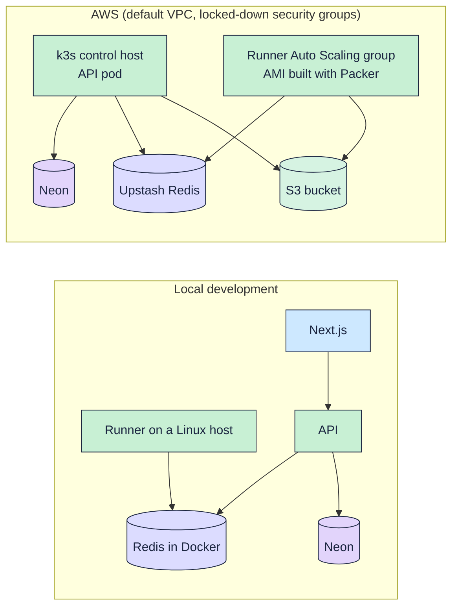

Infrastructure is Terraform (`infra/bootstrap`, `infra/neon`, `infra/aws`), the runner image is Packer plus Ansible, and the API runs on k3s as a Helm chart (`helm upgrade --install`, [ADR 0026](docs/adr/0026-helm-chart-for-the-api.md)) with CI-driven deploys. Nothing in the cloud is applied without an explicit confirmation, and the status of each piece is in the [launch checklist](docs/launch-checklist.md).

### Scaling and capacity

- The API is stateless apart from Redis, so more API replicas can run behind the same Redis and Postgres.
- Judging capacity is the number of runners. Adding a runner adds a consumer to the same group with no coordination.
- The bottlenecks to watch are Redis commands (the Upstash plan limit is unchecked; idle polling is tuned in [ADR 0028](docs/adr/0028-redis-command-budget.md)), Neon connections and compute, and runner CPU and memory.
- `tools/loadtest` drives sign-up, problem list, Run, Submit and SSE (and a contest mode) with a configurable number of users, so these limits can be measured rather than guessed. See [ADR 0024](docs/adr/0024-load-test-tool.md). No throughput figures are claimed here until a run on the real stack is recorded.

### Key decisions

The reasoning behind each choice is in `docs/adr/`: [sandbox design](docs/adr/0004-sandbox-design.md), [verdicts from host facts](docs/adr/0007-verdicts-from-host-facts.md), [queue reclaim and runner privileges](docs/adr/0008-queue-reclaim-and-runner-privileges.md), [idempotent verdict ingest](docs/adr/0009-idempotent-verdict-ingest.md), [problem tests in object storage](docs/adr/0011-problem-tests-in-object-storage.md), [live status over SSE](docs/adr/0012-live-status-sse-and-reaper.md), [nsjail versus gVisor](docs/adr/0013-sandbox-nsjail-vs-gvisor.md), [accounts, sessions and limits](docs/adr/0017-accounts-sessions-and-limits.md), [contest model and scoring](docs/adr/0023-contest-model-and-scoring.md) and [leaderboard ranking and cache](docs/adr/0025-leaderboard-ranking-and-cache.md).

## Observability

The stack is Prometheus (metrics and alert rules), Grafana (a dashboard of the submission flow), Loki (logs), Tempo (traces) and Alloy (ships the JSON logs to Loki). It runs in Docker Compose on the owner's machine, not in the cloud, and costs nothing extra. [ADR 0019](docs/adr/0019-observability.md) has the reasoning, and [ADR 0027](docs/adr/0027-tracing-with-tempo.md) covers traces.

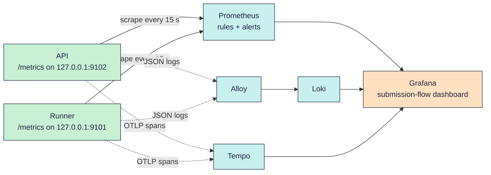

| Question | Answered by |
|---|---|
| Is the API or a runner up? | Prometheus `up` and the runner's last poll time. Alerts `APIDown`, `RunnerDown`, `RunnerSilent`, and `RunnerHostFailures` when runners fail for host reasons (receive, judge or publish) |
| Is work piling up? | The API samples the queue (waiting, pending, oldest age, dead letters) every 60 s. Alerts `QueueBacklog`, `QueueStuck`, `DeadLetters`, `QueueSampleFailing` |
| Are requests failing? | HTTP counts and latency by route template and status. Alert `API5xxRate` |
| Are verdicts healthy? | Verdict counts by language. Alert `InternalErrorVerdicts` fires when a submission ends with IE, which is the platform's fault, not the user's |
| What happened to one submission? | Loki, by `service` and `level`. Submission, user and problem ids are never metric labels; they stay in the logs |
| Where did the time go for one submission? | Tempo. One trace covers the API request, the queue wait and the runner's judging; search by `submission_id`, then jump to its Loki lines |

<table width="100%">
  <tr>
    <td width="50%"><a href="docs/images/observability/04-grafana-dashboard-submission-flow.jpg">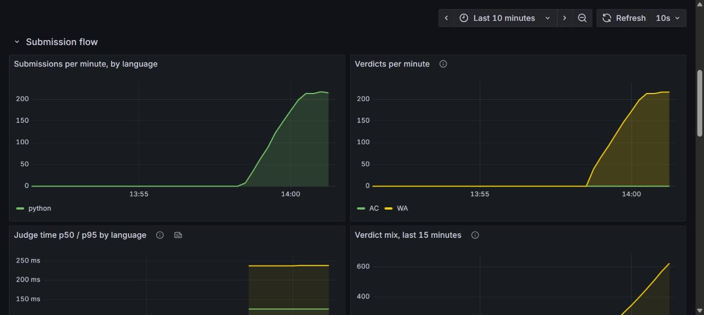</a><br><sub><b>Grafana</b>: submissions and verdicts per minute and judge time during the load test.</sub></td>
    <td width="50%"><a href="docs/images/observability/11-tempo-trace-submission.jpg">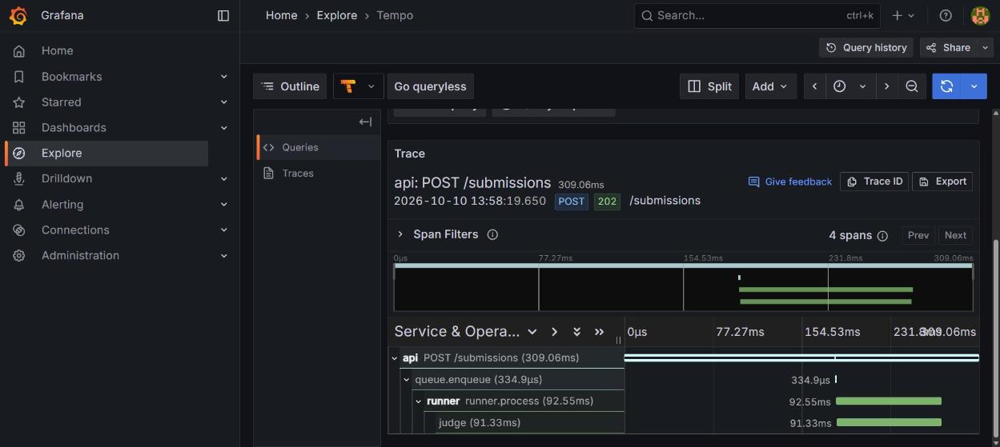</a><br><sub><b>Tempo</b>: one submission from the API request through the queue to the runner and the judge.</sub></td>
  </tr>
  <tr>
    <td width="50%"><a href="docs/images/observability/06-grafana-dashboard-api-and-alerts.jpg">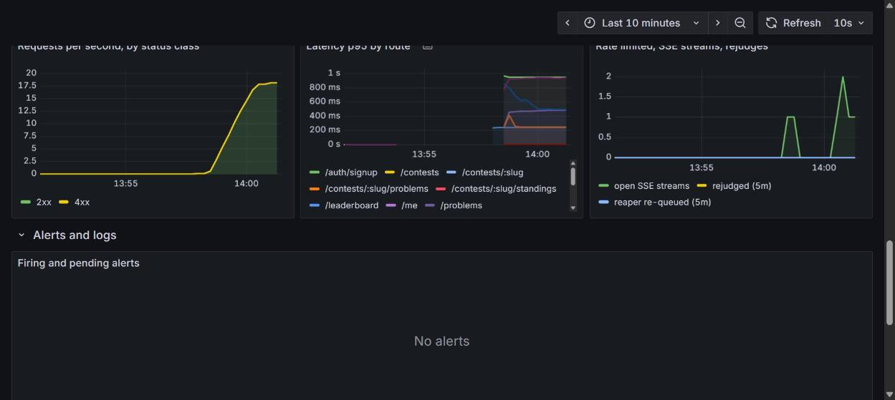</a><br><sub><b>Grafana</b>: API request rate and p95 latency by route.</sub></td>
    <td width="50%"><a href="docs/images/observability/09-loki-runner-logs.jpg">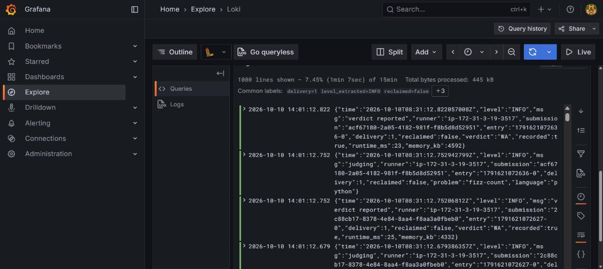</a><br><sub><b>Loki</b>: runner JSON logs (judging, verdict reported). More in <a href="docs/images/observability/">docs/images/observability/</a>.</sub></td>
  </tr>
</table>

Every metric starts with `leetforce_`, and label values come from small fixed sets, so the metric count stays bounded. The alert rules have unit tests (`make test-alerts`).

```bash
make dev-obs                 # start Prometheus, Grafana, Loki, Tempo and Alloy (needs Docker)
scripts/obs-tunnel.sh        # SSH tunnel: metrics ports out, trace port (4318) back
# set LEETFORCE_OTLP_ENDPOINT=http://127.0.0.1:4318 for the API and runner to send traces; empty = tracing off
scripts/obs-logs.sh          # copy the host's logs for Alloy to ship
# Grafana is on http://localhost:3001, Prometheus on http://localhost:9090
make down-obs
```

Limits: the alerts have no notifier (they show on the Prometheus Alerts page and on the dashboard), and the stack is not deployed alongside the cloud runners yet.

## AWS identity and access (IAM)

Access to AWS is by roles, not long-lived keys. The roles are defined in Terraform ([infra/aws/main.tf](infra/aws/main.tf), [infra/aws/ci.tf](infra/aws/ci.tf)); nothing is applied until the owner confirms it.

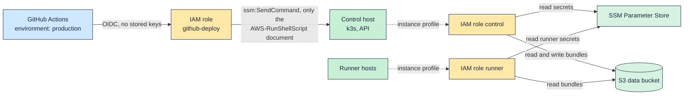

| Role | Who assumes it | What it may do |
|---|---|---|
| `leetforce-runner-*` | Runner EC2 instances, through an instance profile | Read the runner's SSM parameters; list and read test bundles in the data bucket. Reading the Terraform state objects in the same bucket is denied |
| `leetforce-control-*` | The k3s control host | Read the API's SSM parameters; read and write test bundles. Also `AmazonSSMManagedInstanceCore`, so Run Command can reach it |
| `leetforce-github-deploy-*` | The CI deploy job, through GitHub OIDC | `ssm:SendCommand` with the `AWS-RunShellScript` document, only to the instance tagged `leetforce-control`, plus read the command result. The trust policy accepts only this repository's `production` environment |

Secrets (database URL, Redis URL) come from SSM Parameter Store in the cloud and from a git-ignored `.env` locally. Open items from the [security review](docs/security-review.md): the API has no TLS in front of it yet (SEC-06), and protecting `main` and requiring reviewers on the `production` environment (SEC-11) is a repository setting the owner must make. The deploy role is effectively root on the control host for anything that reaches `main`, which is why SEC-11 matters.

### Database: Neon, not Amazon RDS

LeetForce uses Neon (serverless Postgres, reached over TLS with `pgx`), not Amazon RDS, so there is no database instance, subnet group or RDS-specific IAM in the Terraform. The only Neon-related Terraform is the project in `infra/neon`. The API speaks standard Postgres, so RDS could replace Neon later, but that has not been tried and would add a recurring instance cost and a VPC to manage (see [docs/cost-review.md](docs/cost-review.md) for the current costs).

## Quickstart (local)

The sandbox needs a real Linux host with cgroup v2, nsjail and passwordless sudo; the project develops on an Ubuntu 24.04 x86 EC2 host ([ADR 0003](docs/adr/0003-dev-environment-ec2-x86.md), `scripts/setup-dev-host.sh`). The web app and API can run anywhere Go and Node run.

1. Configure. Copy `.env.example` to `.env` (git-ignored) and fill it in:
   - `LEETFORCE_REDIS_URL`: an Upstash `rediss://` URL, or `redis://127.0.0.1:6379/0` for the local Redis from step 2.
   - `DATABASE_URL`: Neon Postgres URL (quote it; it contains `&`). `LEETFORCE_MIGRATE_DATABASE_URL` is the optional direct endpoint for migrations.
   - `LEETFORCE_S3_ENDPOINT`, `LEETFORCE_S3_BUCKET`, `LEETFORCE_S3_ACCESS_KEY`, `LEETFORCE_S3_SECRET_KEY`, `LEETFORCE_S3_USE_TLS`: real S3 (ADR 0021). Leave `LEETFORCE_S3_ENDPOINT` empty to read problems straight from `problems/`.
   - `LEETFORCE_API_URL` (web to API, default `http://127.0.0.1:8080`), `LEETFORCE_TRUSTED_PROXIES` (use `127.0.0.1` behind the Next.js proxy), optional `LEETFORCE_LIMIT_*`, and `LEETFORCE_GRAFANA_PASSWORD` for the observability stack.
2. Local Redis: `make dev` (Docker Compose; Redis only, S3 is real AWS S3 since Phase 13). `make down` stops it.
3. Database: `make migrate-up` (goose, `api/migrations`, URL from `.env`).
4. Build and start, each in its own terminal, with `.env` loaded into the environment:
   ```bash
   make build-api build-runner
   bin/api                            # listens on :8080 (LEETFORCE_API_ADDR), metrics on 127.0.0.1:9102
   sudo -E bin/runner                 # root, or the unprivileged systemd unit in scripts/runner (ADR 0014); metrics on 127.0.0.1:9101
   cd web && npm ci && npm run dev    # http://localhost:3000
   ```
5. Open http://localhost:3000/problems, sign up, pick a problem, and use Run (Ctrl+Enter) or Submit (Ctrl+Shift+Enter).

Judge a solution without the queue, API or web (local judge CLI, needs root and nsjail):

```bash
make build-judge
sudo -n bin/judge run problems/sample-sum problems/sample-sum/solutions/python/ac.py   # exit 0 = AC
sudo -n bin/judge run -all -detail -lang cpp problems/sample-sum <solution-file>
make validate-problems                                                                  # structure + reference solutions for every problem
```

## Commands

Go targets run per module in `GO_MODULES` (`judge queue runner api storage`) on a Linux host. Targets marked BILLABLE or "real DB" touch real services; read the Makefile comment first.

| Command | What it does |
|---|---|
| `make dev` / `make down` | Start / stop the local Redis (Compose) |
| `make fmt` / `make lint` / `make test` | Format, vet + golangci-lint, `go test` per Go module (sandbox-backed tests skip without root) |
| `make test-sandbox` | Functional sandbox and judge-engine tests in nsjail (`sudo -n`) |
| `make test-adversarial [RUN=TestName]` | Sandbox containment suite, run as root in a memory-capped systemd scope |
| `make test-matrix` | Phase 2 exit test: one solution per verdict in each language (28 runs) |
| `make bench-sandbox` | nsjail vs gVisor benchmark (needs `runsc`, `scripts/setup-gvisor.sh`) |
| `make build-judge` / `make build-runner` / `make build-api` | Build `bin/judge`, `bin/runner` + `bin/lfq`, `bin/api` |
| `make validate-problems [DIR=problems/<slug>]` | `judge validate` for every problem (sandbox, `sudo -n`) |
| `make migrate-up` / `migrate-down` / `migrate-status` | goose migrations on Neon |
| `make test-crash` | Kill a runner mid-job; another reclaims it; one verdict (needs `LEETFORCE_REDIS_URL`) |
| `make test-api-e2e`, `test-live-e2e`, `test-auth-e2e`, `test-rejudge-e2e` | End-to-end gates for Phases 4, 5, 9, 10 (real DB and Redis; they delete the rows they create) |
| `make test-obs-e2e` | Phase 11: metrics follow a live flow (dev host) |
| `make dev-obs` / `make down-obs` / `make test-alerts` | Prometheus, Grafana, Loki, Tempo, Alloy stack; promtool alert tests (Docker) |
| `make tf-validate` | `fmt` and `validate` for the three Terraform stacks (no credentials) |
| `make test-destroy-isolation` | Offline check that destroying `infra/aws` cannot reach `infra/neon` |
| `make packer-validate` / `make lint-ansible` | Validate the AMI template / lint the playbook (Docker, free) |
| `make build-ami` | BILLABLE: build the runner AMI (a `t3.small` builder for about 15 minutes, then a snapshot) |
| `make test-runner-loss` | BILLABLE and destructive: terminate a runner EC2 host under load (needs `LEETFORCE_CONFIRM_TERMINATE=yes`); not run yet |
| `scripts/arena.sh up\|down\|status` | BILLABLE: create or destroy `infra/aws` (typed confirmation); never touches `infra/neon` |
| `scripts/k3s/push-ssm.sh [--apply]` | Stage SSM parameters (dry run unless `--apply`) |
| `scripts/scan-staged.sh [full]` | Trivy on the staged tree via the dev host |
| `cd api && go run ./cmd/rejudge [-dry-run] <slug>` | Sync one problem and rejudge its stale submissions |
| `cd web && npm run lint`, `npm run typecheck`, `npm run build` | Frontend checks |

## Cost table

Recurring costs that are billed while the resource exists or runs. Dollar figures are **UNVERIFIED list-price assumptions** for `ap-south-1` (Mumbai), written from memory of AWS public pricing and not read from the account's bill or the AWS pricing pages: `t3.micro` about $0.0104 per hour, `t3.small` about $0.0208 per hour, gp3 about $0.0912 per GB-month, public IPv4 $0.005 per hour, S3 Standard about $0.025 per GB-month, 730 hours per month. Check the AWS pricing pages and Cost Explorer before relying on them. A month-by-month estimate is in [docs/cost-review.md](docs/cost-review.md).

| Resource | Introduced | Billing | Approx. cost, UNVERIFIED | State today |
|---|---|---|---|---|
| EC2 `t3.micro` dev host (`leetforce-dev`) | Phase 1 | Per hour while running | about $7.6 a month if left running | Existed and running at the last recorded check (phase-13 log); stop it when idle. t3 unlimited CPU credits can add surplus charges under sustained CPU. See [ADR 0003](docs/adr/0003-dev-environment-ec2-x86.md). |
| EBS gp3 volume, 15 GiB (dev host) | Phase 1 | Per GB-month, also while stopped | about $1.4 a month | Exists; deleted only when the instance is terminated. |
| Public IPv4 address (dev host) | Phase 1 | Per hour while attached | about $3.7 a month | Attached while running; changes on stop/start unless an Elastic IP is attached (an unattached Elastic IP is also billed). |
| EC2 `t3.small` control host (`leetforce-control`) | Phase 12 | Per hour while it exists and runs | about $15.2 a month | Code only. Created by `scripts/arena.sh up` (typed confirmation); `control_instance_type` in `infra/aws`. |
| EC2 `t3.small` runner hosts, Auto Scaling group (`runner_count`, default 1) | Phase 12, ASG in Phase 13 | Per hour each; the group itself is free | about $15.2 a month each | Code only. The group keeps `runner_count` instances (min = max = desired) until `arena.sh down`; a replacement host costs the same as the one it replaces. |
| EBS gp3 volume, 15 GiB, encrypted, per new host | Phase 12 | Per GB-month each | about $1.4 a month each | Code only. Deleted with the instance (`delete_on_termination`). |
| Public IPv4 address per new host | Phase 12 | Per hour each while attached | about $3.7 a month each | Code only. Needed because there is no NAT gateway; the control host and every runner has one. |
| EC2 `t3.small` k3s agent nodes for KEDA-scaled runner pods (`runner_node_count`, default 0) | Phase 17 | Per hour each; the group itself is free | about $15.2 a month each | Code only, never validated, planned or applied; `0` creates nothing. The node count is fixed: KEDA scales pods, not nodes, and pods that do not fit stay Pending. See [ADR 0029](docs/adr/0029-keda-scaled-runner-pods.md). |
| EBS gp3 volume, 20 GiB, encrypted, per agent node | Phase 17 | Per GB-month each | about $1.8 a month each | Code only. Deleted with the instance. |
| Public IPv4 address per agent node | Phase 17 | Per hour each while attached | about $3.7 a month each | Code only. Same reason as the other hosts (no NAT gateway). |
| Runner AMI snapshot (Packer) | Phase 12 | Per GB-month of snapshot while the AMI is registered | up to about $0.75 a month for a full 15 GiB at an assumed $0.05 per GB-month | No AMI exists (three build attempts failed: build tooling, a scan timeout, base-image findings; a fourth was not run). A build also bills a `t3.small` builder for about 15 to 18 minutes (a few cents; the failed attempts billed about the same). Deregister old AMIs and delete their snapshots. |
| Neon Postgres project (`ap-southeast-1`) | Phase 4, adopted by Terraform in Phase 12 | Depends on the Neon plan | UNVERIFIED: plan and limits never checked. `infra/neon` assumes the free plan (6 h restore window, the free maximum) | Exists. Compute wakes on use; the reaper sweeps every 15 minutes and each sweep wakes it. |
| Upstash Redis | Phase 3 | Depends on the Upstash plan (monthly command budget) | UNVERIFIED: plan and limit never checked. Idle polling by one API and one runner is about 9k commands a day, about 0.27M a month ([ADR 0028](docs/adr/0028-redis-command-budget.md); it was about 2.7M a month before, which exhausted the free tier) | Exists. Each extra runner adds about 2.8k a day idle; the queue-depth sampler runs every 5 minutes (`LEETFORCE_METRICS_QUEUE_EVERY`). Phase 17, UNVERIFIED: each runner pod that is up adds the same, and KEDA adds about 1.4k a day (one `XLEN` a minute); four pods up all day plus the API come to about 19k a day, above the believed free limit (ADR 0029). |
| S3 bucket `leetforce-<account id>-data` (versioned, SSE-S3) | Phase 13 | Per GB-month plus requests | well under $1 a month: a few MB at about $0.025 per GB-month, plus requests | Exists (applied in Phase 13, owner approved). Holds `problems/` bundles (kept for rejudges) and `tfstate/` (old versions expire after 90 days, ADR 0021). |
| Container images in GHCR (private) | Phase 13 | Free within GitHub's package allowance | UNVERIFIED allowance | Nothing pushed yet. The API image holds the hidden tests, so it must stay private. |

Not billable: SSM Parameter Store standard parameters, SSM Run Command, GitHub Actions OIDC, IAM roles and security groups, and the Terraform state lock (the S3 lock file, no DynamoDB table). No VPC endpoints, NAT gateway or Elastic IPs are used. Data transfer out of AWS is billed per GB after the free allowance and is not estimated here (UNVERIFIED; expected near zero at current traffic). As of the last recorded state, the S3 bucket and the dev host exist; nothing in `infra/aws` has been applied and no AMI has been built, so the control and runner rows apply from the first `arena.sh up` or successful `make build-ami`.

## Documentation

| Topic | Where |
|---|---|
| Phase plan and progress | [docs/PLAN.md](docs/PLAN.md), [docs/PROGRESS.md](docs/PROGRESS.md) |
| How a submission flows, phase by phase | [docs/FLOW.md](docs/FLOW.md) |
| Decisions and their trade-offs | [docs/adr/](docs/adr/) |
| Per-phase reports and plain-language summaries | [docs/phases/](docs/phases/) |
| Observability design | [docs/adr/0019-observability.md](docs/adr/0019-observability.md), [docs/adr/0027-tracing-with-tempo.md](docs/adr/0027-tracing-with-tempo.md), [observability/](observability/) |
| Infrastructure and IAM | [docs/adr/0020-infrastructure-as-code.md](docs/adr/0020-infrastructure-as-code.md), [infra/](infra/) |
| Security review and findings | [docs/security-review.md](docs/security-review.md) |
| Backup and restore runbook | [docs/runbook-backup-restore.md](docs/runbook-backup-restore.md) |
| Cost review | [docs/cost-review.md](docs/cost-review.md) |
| KEDA-scaled runner pods (Phase 17, written and never run) | [docs/adr/0029-keda-scaled-runner-pods.md](docs/adr/0029-keda-scaled-runner-pods.md), [docs/phases/phase-17-log.md](docs/phases/phase-17-log.md) |
| What is left before a public launch | [docs/launch-checklist.md](docs/launch-checklist.md) |
